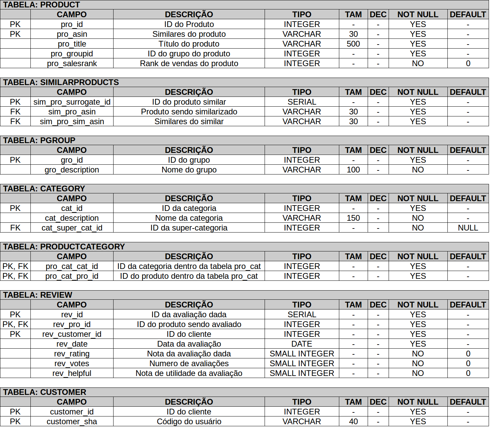
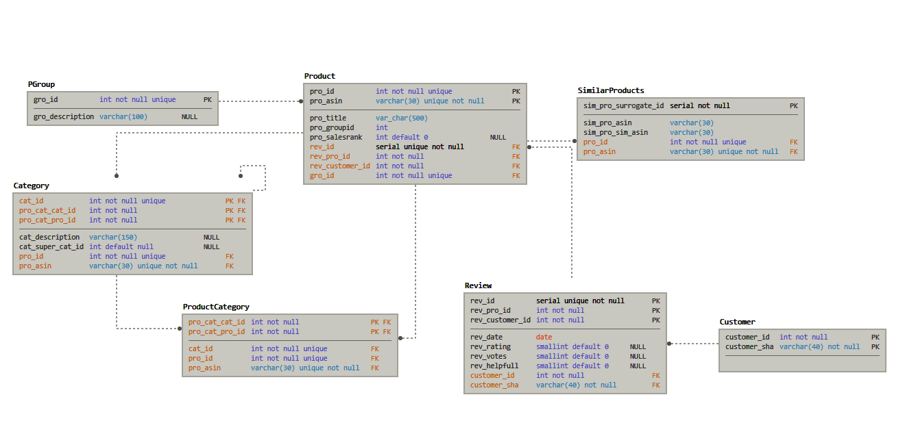
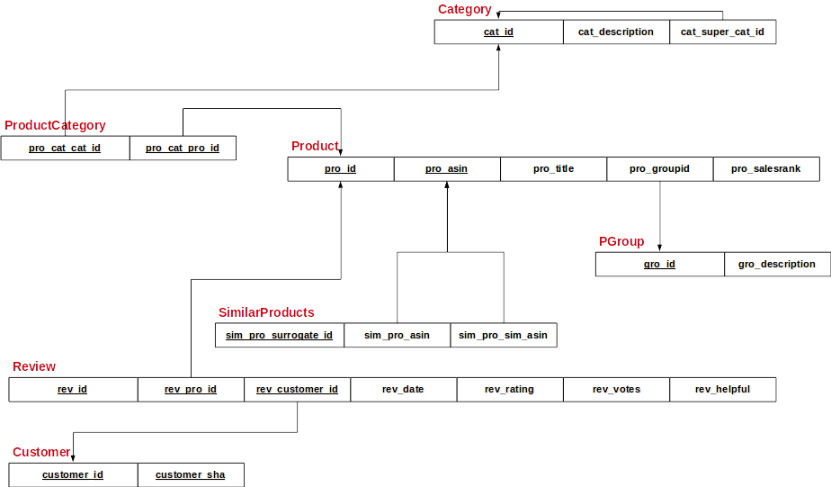

# Trabalho Prático 2

### Alunos

**Ruan Barros** - rggb@icomp.ufam.edu.br

**Oscar Othon** - oowsl@icomp.ufam.edu.br

## Banco de Dados e Esquemas

A princípio, escolhemos a FN3 para a criação do esquema do banco de dados. Os domínios atribuídos à cada esquema de cada relação foram estipulados com testes para melhor atender à massa de dados a ser inserida no banco.

<center><b>Dicionário de Dados</b></center>



<center><b>Diagrama Relacional</b></center>






### Restrições de Integridade

Para cada tabela, os atributos referenciados por setas no diagrama relacional representam uma referência de uma restrição de integridade referencial.

- **Product** - possui restrição de integridade referencial com _PGroup_ e de _Category_, já que um produto precisa de um grupo e de uma categoria.

- **SimilarProduct** - possui restrição de integridade com _Product_, já que a similaridade entre produtos só existe quando produtos existem.

- **PGroup** - não possui restrição de integridade referencial direcionada para nenhuma outra relação.

- **Category** - possui restrição de integridade referencial com ela mesma, já que uma categoria pode ter nenhuma ou uma supercategoria.

- **ProductCategory** - possui restrição de integridade referencial com _Category_ e _Product_, já que para referenciar a categoria de um produto, é necessário que exista tanto a categoria à ser referenciada quanto o produto à ser amarrado à categoria.

- **Review** - possui restrição de integridade referencial com _Customer_ e _Product_, já que é necessário um cliente classificando um produto.

- **Customer** - não possui restrição de integridade direcionada para ninguém.


## Consultas do Dashboard

(a)Dado produto, listar os 5 comentários mais úteis e com maior avaliação e os 5 comentários mais úteis e com menor avaliação

```sql
 (select * from review join customer on rev_customer_id = customer_id join product on rev_pro_id = pro_id where pro_asin = '%s' order by rev_rating desc, rev_helpful desc limit 5) union all (select * from review join customer on rev_customer_id = customer_id join product on rev_pro_id = pro_id where pro_asin = '%s' order by rev_rating, rev_helpful desc limit 5);
```

(b)Dado um produto, listar os produtos similares com maiores vendas do que ele

```sql
    select p2.pro_id,p2.pro_asin,p2.pro_title,p2.pro_salesrank from product p, similarproducts, product p2 where p.pro_asin = sim_pro_asin and p2.pro_asin = sim_pro_sim_asin and p.pro_salesrank <= p2.pro_salesrank and p2.pro_salesrank > 0 and p.pro_asin = '%s';
```

(c)Dado um produto, mostrar a evolução diária das médias de avaliação ao longo do intervalo de tempo coberto no arquivo de entrada  

```sql
    select r.rev_date, avg(rev_rating) as rev_rating_average from product join review r on rev_pro_id = pro_id where pro_asin = '%s' group by r.rev_date order by rev_date;
```

(d)Listar os 10 produtos lideres de venda em cada grupo de produtos

```sql    
    SELECT rank_filter.gro_description,rank_filter.pro_asin, rank_filter.pro_title,rank_filter.pro_salesrank  FROM (
        SELECT *, 
        rank() OVER (
            PARTITION BY gro_id
            ORDER BY pro_salesrank ASC
        )
        FROM (select * from pgroup join product on pro_groupid = gro_id where pro_salesrank > 0) as did
    ) rank_filter where rank <= 10;
```

(e)Listar os 10 produtos com a maior média de avaliações úteis positivas por produto


```sql
    select pro_title, avg(rev_rating) as ravg, avg(rev_helpful) as havg 
    from review join product p on rev_pro_id = pro_id
    group by pro_id, pro_title order by ravg desc, ravg desc limit 10
``` 


(f)Listar a 5 categorias de produto com a maior média de avaliações úteis positivas por produto

```sql
    select cat_id,cat_description, avg(p.ravg) cat_avg from category join productcategory on cat_id = pro_cat_cat_id join  (select p.pro_id,avg(rev_rating) as ravg, avg(rev_helpful) as havg from review  join product p on rev_pro_id = pro_id  group by pro_id) as p on p.pro_id = pro_cat_pro_id group by cat_id,cat_description order by cat_avg desc limit 5;
``` 


(g) Listar os 10 clientes que mais fizeram comentários por grupo de produto:


```sql
    SELECT gro_id, customer_sha, c  FROM (
        SELECT *, 
        rank() OVER (
            PARTITION BY gro_id
            ORDER BY c DESC
        )
        FROM (  select rev_customer_id,gro_id, count(*) as c from product
        join review on rev_pro_id = pro_id
        join pgroup on gro_id = pro_groupid
        join customer on rev_customer_id = customer_id
        group by rev_customer_id, gro_id
        order by c desc) as did
    ) rank_filter
    join customer cp on rev_customer_id = cp.customer_id
  where rank <= 10
    order by gro_id, rank;
```


### Decisões de Projeto

- Optamos por criar uma tabela adicional `Customer` para conter atualizações no `sha` de determinado usuário.

- Optamos por criar uma tabela para armazenar as categorias de um produto para respeitar a `FN3`

- Optamos por criar uma tabela para armazenas as avaliações de um produto por um usuário

- Optamos por realizar `bulk-insert`'s para aumentar a velocidade de processamento na inserção no banco de dados.


## Arquivos

Nossa implementação resultou em 5 arquivos `.py`. 

- **beans.py** - utilizado para armazenar as representações das relações no banco de dados.

```
class SimilarProducts:
    mainProductAsin = None  # pk #fk_product
    similarProductAsin = None  # pk #fk_product


class ProductCategory:
    productId = None  # pk #fk_product
    categoryId = None  # pk #fk_category

...    

```

- **dashboard.py** - utilizado para conter o dashboard implementado, realizando consultas no banco de dados.

- **parser.py** - utilizado para realizar o parsing do arquivo contendo a massa de dados. 
- **query.py** - utilizado para armazenar as consultas, tais como a de criação do esquema do banco de dados.

- **schemafactory.py** - utilizado para gerenciar as operações do parsing e de transações com o banco de dados.


## Utilização na execução

Antes de tudo, utilizamos `Python 2.7.12` e a biblioteca de conexão com postgresql `psycopg2` compativel com tal versão.

Somente dois dos arquivos serão utilizados diretamente para executar de fato as operações requeridas do trabalho : 

- `schemafactory.py`  : 

Para criar o schema, é necessário passar como parâmetro para a execução o endereço de ip para a conexão, o nome do usuário, a senha, o nome da base de dados e o nome do arquivo contendo a massa de dados. 

**Entrada :**

- argv[1] - IP
- argv[2] - usuário
- argv[3] - senha
- arvg[4] - nome do banco
- argv[5] - nome do arquivo contendo a massa de dados

**Exemplo :**

```shellscript
python schemafactory.py localhost postgres 123 sw_trab02 "./docs/amazon-meta.txt" 
```

- `dashboard.py`  : 

Para executar o dashboard, é necessário passar como parâmetros as mesmas informações passadas para o `schemafactory.py`, porém, não é necessário indicar o nome do arquivo de dados, já que não será mais utilizado.


**Entrada :**

- argv[1] - IP
- argv[2] - usuário
- argv[3] - senha
- arvg[4] - nome do banco

**Exemplo :**

```shellscript
python dashboard.py localhost postgres 123 sw_trab03
```

## Dados Adicionais

Durante a implementação, o tempo de criação do banco de dados foi amortizado e a média do tempo de execução é de 10 minutos na máquina com a seguinte configuração : 

```Architecture:          x86_64
CPU op-mode(s):        32-bit, 64-bit
Byte Order:            Little Endian
CPU(s):                4
On-line CPU(s) list:   0-3
Thread(s) per core:    2
Core(s) per socket:    2
Socket(s):             1
NUMA node(s):          1
Vendor ID:             GenuineIntel
CPU family:            6
Model:                 69
Model name:            Intel(R) Core(TM) i5-4200U CPU @ 1.60GHz
Stepping:              1
CPU MHz:               1356.219
CPU max MHz:           2600.0000
CPU min MHz:           800.0000
BogoMIPS:              4589.39
Virtualization:        VT-x
L1d cache:             32K
L1i cache:             32K
L2 cache:              256K
L3 cache:              3072K
NUMA node0 CPU(s):     0-3
RAM : 6 GB DDR2
```